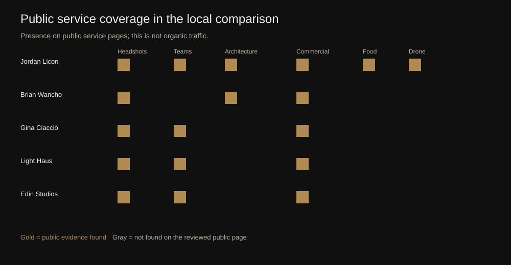
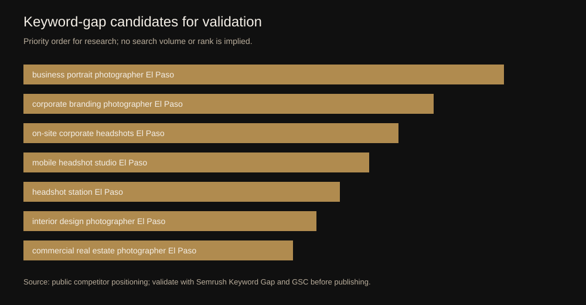
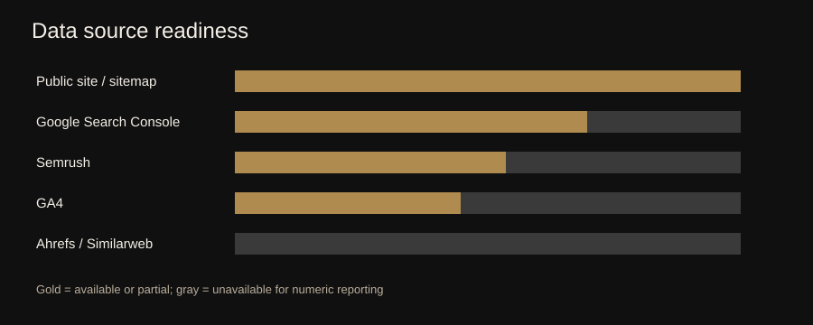

# SEO competitor analysis: jordanliconphotography.com

**Prepared:** September 23, 2026  
**Primary sources:** live public pages, local sitemap and SEO records, Google Search Console snapshot, Semrush Site Audit record, public competitor pages

## Executive narrative

Jordan Licon Photography has the broadest visible service footprint in this local comparison: headshots, corporate teams, architecture, commercial work, food, drone, cinematography, and editorial photography. The strongest public competitors are more focused. Brian Wancho concentrates on architecture, commercial work, and business portraits; Gina Ciaccio and Light Haus Studio emphasize headshots and corporate branding; Edin Studios emphasizes high-volume on-site headshot production.[1][2][3][4][5]

The available evidence supports a protection-and-expansion posture. The site already has a deliberate page-to-intent map, strong service coverage, and a public proof set. The next ranking gains should come from measuring actual query overlap, confirming which pages receive non-branded impressions, and adding only validated pages or sections for gaps such as on-site corporate headshots, mobile headshot stations, business portraits, and interior design photography.[6][7]

## Part 1: organic search performance

### 1. Business context and SEO footprint

**The site is structured around commercial service pages, portfolio proof, and inquiry conversion.** The current map assigns one primary intent to each commercial page, including El Paso commercial photographer, headshot photographer, executive headshots, corporate team headshots, architectural photographer, food photographer, drone photography, cinematography, and editorial portrait photography.[6]

The live homepage exposes these service routes, pricing signals, project inquiry fields, client proof, and local business details. That gives Google a clear set of indexable commercial destinations and gives buyers a direct route from service discovery to inquiry.[1]

### 2. Page-type analysis

**Commercial service pages are the main demand-capture layer; portfolio pages supply proof; articles support narrower research queries.** The local keyword map contains 15 commercial or authority pages and 14 supporting article topics. The page ownership model keeps purchase-ready terms on service pages and assigns preparation, planning, and educational questions to articles.[6]

| Page type | Current role | Confirmed examples | Interpretation |
| --- | --- | --- | --- |
| Service pages | Capture purchase-ready local demand | Headshots, architecture, commercial, food, drone | Highest conversion value; keep each page tied to one primary intent |
| Portfolio pages | Provide visual proof and topical depth | Headshot, architecture, food, drone, portrait/fashion | Support trust and image search; link back to the matching service page |
| Authority page | Validate experience | Credits and recognition | Useful for branded, referral, and entity trust searches |
| Supporting articles | Answer research questions | Headshot preparation, project planning, aerial techniques | Use to support service pages without creating duplicate local pages |
| Inquiry and confirmation pages | Convert and measure leads | Contact form and success page | Keep the `generate_lead` measurement verified in GA4 before using it for decisions |

Numeric organic traffic and click share by page type are unavailable until GSC or Semrush landing-page exports are provided.

### 3. Organic visibility by country

**The visible target market is El Paso and the Southwest, but country-level organic performance is not measured in this report.** The public site states El Paso, Texas, and the surrounding Southwest region as the service area. The site also references Texas and New Mexico in its commercial positioning.[1]

Semrush, Similarweb, and GSC country exports were not available, so this report does not assign traffic shares or claim country growth.

### 4. Traffic trend

**A trend verdict cannot be made from the available evidence.** The local records document technical work, a 37-page sitemap crawl, and a successful publication, but they do not contain a time series of organic clicks, sessions, or leads. The next measurement cycle should use GSC clicks and impressions as the primary trend source, GA4 engaged sessions and `generate_lead` as the conversion source, and Semrush as a directional competitor source.[7]

### 5. Branded vs non-branded search

**The site has clear branded assets, but the branded/non-branded split remains unquantified.** The brand has a named domain, local business identity, public reviews, magazine covers, credits, and client references. The commercial opportunity is the non-branded layer: local headshot, corporate team, architecture, food, commercial, drone, and cinematography searches.[1][6]

No GSC query export was available, so keyword count, click share, and impression share cannot be reported honestly. The first export should classify queries by Jordan/brand terms versus service-and-location terms, then compare each segment by landing page and lead rate.

## Part 2: backlink strategy evidence

### 6. Backlinks: is the site building links for SEO growth?

**There is not enough backlink evidence to classify the current strategy.** Public pages confirm authority assets such as magazine covers, federal and agency work, IMDb credits, Yahoo Finance coverage, PPA membership, and local business membership.[1] Those assets can support natural citations and referral links, but public proof does not reveal link velocity, referring-domain quality, anchor distribution, or destination-page targeting.

The backlink comparison remains pending Ahrefs, Semrush Backlink Gap, or another export containing referring domains, new and lost links, anchors, target URLs, source country or TLD, and dates. Until then, no claim about natural, SEO-led, or low-quality link acquisition should be made.

## Part 3: what should happen next

### 7.1 GA4 evidence now available

The GA4 property recorded 279 sessions and 231 engaged sessions from August 26 through September 22, 2026. Organic Search had fewer sessions than Direct or Organic Social, but its engagement rate and average engagement time were materially stronger than Organic Social. The Lead acquisition report recorded one new lead, zero qualified leads, and zero converted leads. The much larger key-event total is therefore not a reliable inquiry count until the event list is audited.

Safari in-app traffic is a clear technical test case: 16 active users produced only 2 engaged sessions and 0 seconds of average engagement time. The mobile inquiry flow should be tested from Instagram and other in-app browsers before further content work.

The full evidence and implementation list is in [GA4 measurement findings](GA4-MEASUREMENT-FINDINGS-2026-09-23.md).

### 8. Clear diagnosis and strategic priorities

| Priority | What to do | Evidence behind it | Why it matters | Success signal |
| --- | --- | --- | --- | --- |
| 1 | Export GSC queries and landing pages for the last 6 months | Current map is strong, but query overlap is unmeasured | Finds pages with impressions but weak clicks and pages competing for the same intent | Non-branded clicks and qualified inquiries rise on priority pages |
| 2 | Run Semrush Keyword Gap and Backlink Gap against the four local competitors | Public SERP evidence identifies a credible comparison set | Converts hypotheses into measured gaps with volume, position, and competitor coverage | Validated gaps become page sections or briefs, not duplicate pages |
| 3 | Test GA4 lead receipt in DebugView | `generate_lead` implementation exists locally, but receipt is unconfirmed | Traffic cannot be judged without a reliable conversion signal | One successful form submission records one lead event |
| 4 | Strengthen the corporate team page around on-site and mobile workflows | Competitors visibly market team and on-site formats | Captures a specific commercial use case without creating a thin new page | Impressions and inquiries for team/on-site queries increase |
| 5 | Expand architecture language only where proof exists | Public competitors use architecture and interior-design terms | Better matches buyers who search by project type | GSC shows impressions for interior, design, and commercial real-estate terms |
| 6 | Build a backlink evidence file before outreach | Current public proof is strong but link metrics are missing | Prevents low-quality or unfocused outreach | Referring domains and target-page links grow from relevant local, design, business, and editorial sources |

### 9. 90-day plan

| Window | Focus | Concrete actions |
| --- | --- | --- |
| Days 0-30 | Measurement and baseline | Export GSC queries/pages/countries/devices; export Semrush Organic Research, Keyword Gap, Backlink Gap, and Site Audit; verify GA4 `generate_lead` once in DebugView; export Similarweb only if the account has usable historical data; preserve source dates and database/location settings. |
| Days 31-60 | Query and content decisions | Classify branded versus non-branded queries; map competitor-only keywords to existing pages; identify cannibalization; update the corporate team page for on-site/mobile needs; add architecture or interior-design sections only where the work and service process support them. |
| Days 61-90 | Authority and review | Compare new/lost referring domains; prepare a short list of relevant local, architecture, business, hospitality, and editorial opportunities; publish or update only validated pages; compare clicks, impressions, inquiries, and page-level conversion rate with the baseline. |

## Final verdict

The site has a strong commercial architecture and a wider visible service range than the local competitors reviewed. The missing piece is measurement, not another round of generic pages. The next useful move is a dated export-based comparison in Semrush and Search Console, followed by a small set of validated content and authority actions.

## References

[1]: https://www.jordanliconphotography.com/ "Jordan Licon Photography live homepage and service map, accessed 2026-09-23"
[2]: https://www.brianwanchophotography.com/ "Brian Wancho Photography public homepage, accessed 2026-09-23"
[3]: https://ginacphotography.com/information/headshots/ "Gina Ciaccio Photography public headshot information page, accessed 2026-09-23"
[4]: https://www.lighthaus-studio.com/corporate/ "Light Haus Studio public corporate photography page, accessed 2026-09-23"
[5]: https://edinstudios.com/headshot-station-el-paso/ "Edin Studios public Headshot Station page, accessed 2026-09-23"
[6]: ../SEO-KEYWORD-MAP.md "Local page-to-intent map, updated 2026-09-20"
[7]: ../SEO-RANKING-EXECUTION.md "Local SEO implementation and measurement status, updated 2026-09-20"
